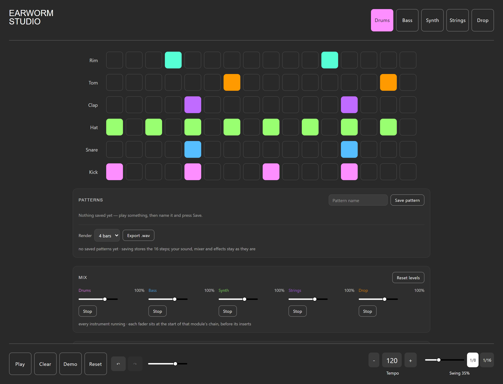
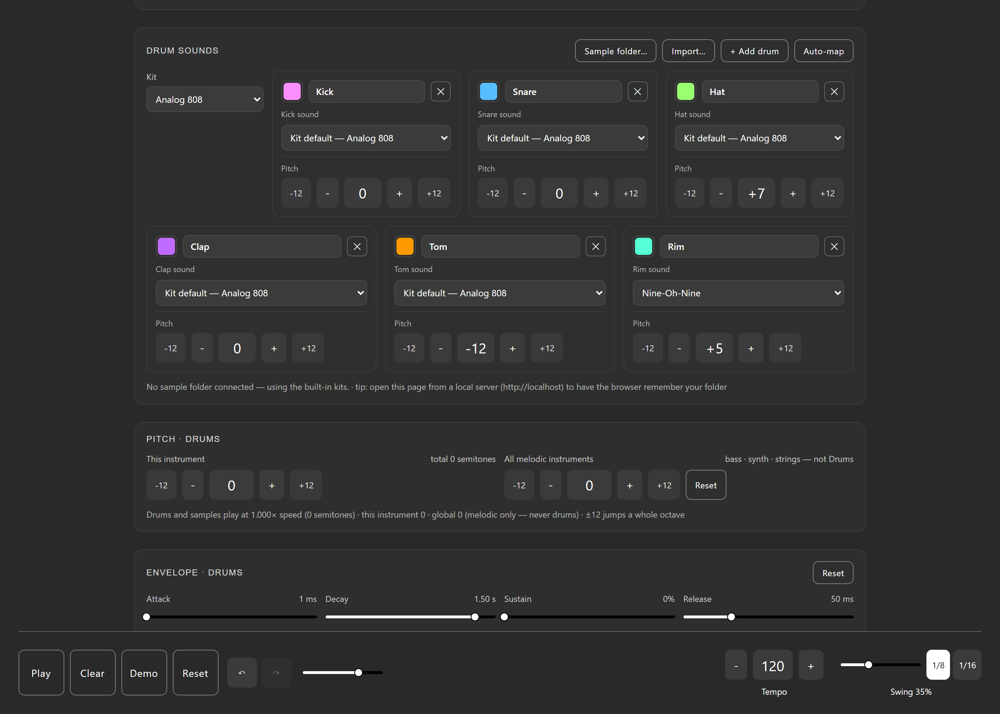
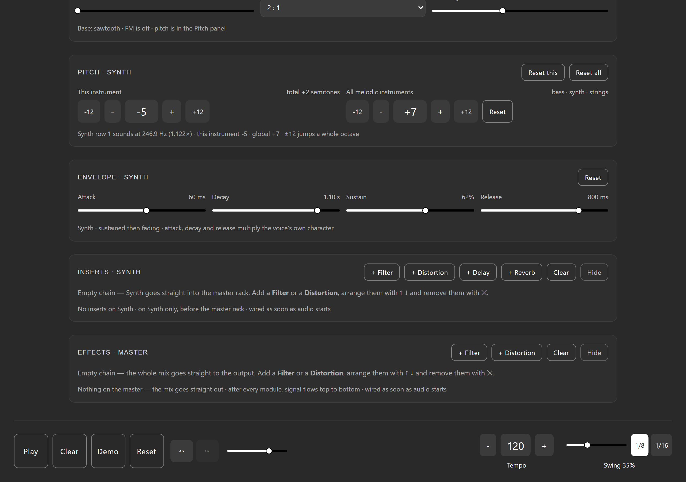
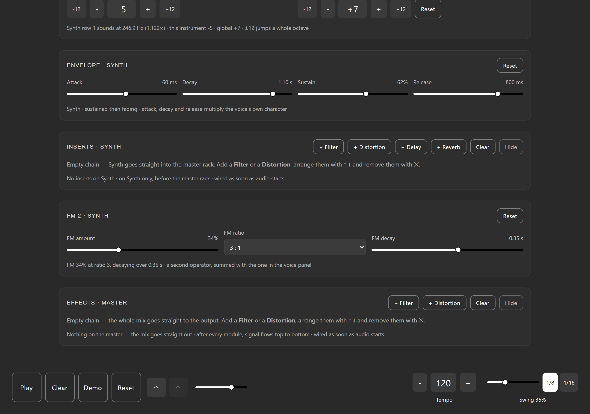
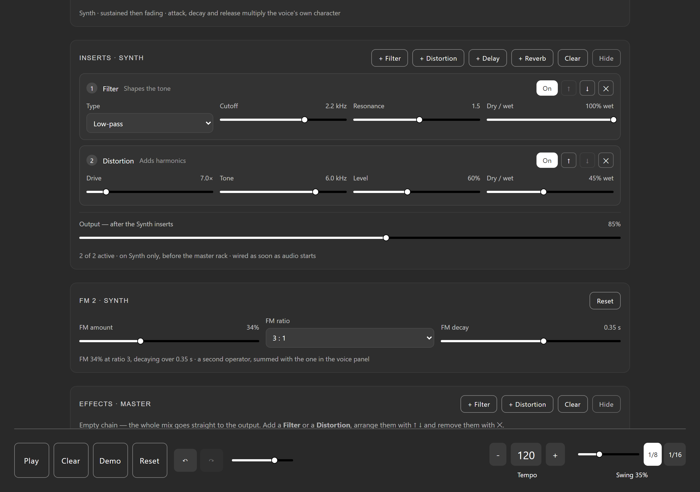
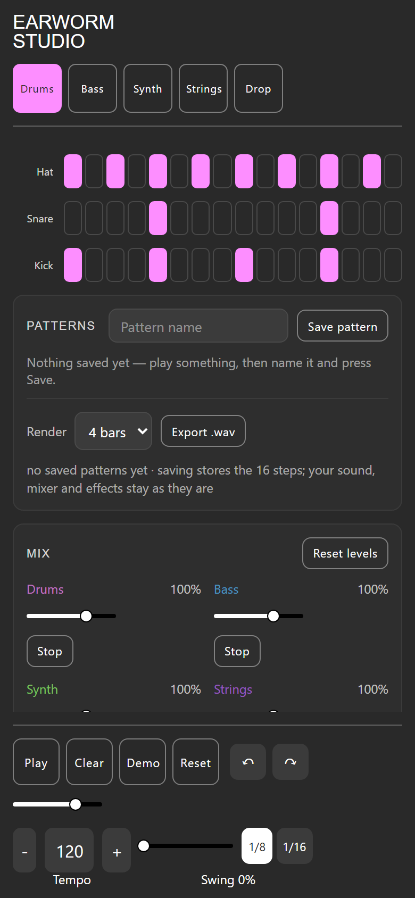
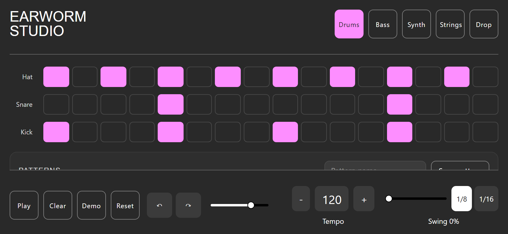

# Earworm Studio

A 16-step sequencer that runs in the browser. No build step, no framework, no
server — open `index.html` and play.



Five instruments (drums, bass, synth, strings, drop), a mixer and effect chain
per channel, FM synthesis, envelopes, sample import, and WAV export.

## Features

**Sequencing**

- 16 steps per instrument, 1/16 or 1/8 grid, swing 0–100%
- Space bar starts and stops from anywhere on the page
- Demo pattern, Clear, and a complete Reset that returns everything to defaults
- Save patterns in the browser and load them back

**Drums are data, not a fixed kit**

- Start with kick / snare / hat, then **add up to 12 drums**
- **Rename** and **recolour** each drum independently — the grid row follows
- **Pitch each drum on its own** (−36 to +12 semitones), on top of the module pitch
- Per-drum sound: built-in kits (808, 909, deep, nine-oh-nine…) or your own samples
- Removed a drum by accident? Undo brings the drum, its row and its steps back



**Synthesis per instrument**

- **FM 1** in the voice panel and **FM 2** after the inserts — two operators that stack
- **ADSR per instrument** (attack, decay, sustain, release) multiplying each voice's
  own character envelope
- Per-instrument pitch plus a global transpose for the melodic instruments
- Filters, distortion, delay and reverb, addable and reorderable per channel




**Mixing**

- Level and stop/start per instrument (pre-insert)
- **Output fader per channel (post-insert)** — the Mix fader sets how hard you drive
  the inserts, the Output fader sets the level leaving them
- Master rack: filter and distortion on the whole mix
- Dry/wet on every effect, on both the inserts and the master



**Samples**

- Point the app at a sample folder once (File System Access API) and pick from a
  dropdown, or import individual files
- Auto-mapping matches file names to lanes — including drums you added and named
- Samples play through the same lane pitch, envelope and FM as the synth voices

**Export and history**

- **WAV export**: renders 1/2/4/8 bars offline, stereo, with the tail included
- **Undo / redo** (Ctrl+Z, Ctrl+Y, Ctrl+Shift+Z) over steps, sounds, mixer,
  effects, pitch, envelopes, FM and drum lanes — `⌘Z` on macOS too

**Mobile**

- The 16 steps share the screen width, so there is no horizontal scrolling
- Effect racks fold away on phones; the transport stays reachable
- Safe-area padding for notched screens




## Getting started

Open `index.html` in a Chromium browser. That's it.

Two optional tips:

- Open the page from a local server (`python -m http.server`) if you want the
  browser to remember your sample folder between visits — `file://` pages cannot
  keep a directory handle.
- Firefox and Safari work, but the sample *folder* picker needs the File System
  Access API, which is Chromium-only. Importing individual files works everywhere.

## Keyboard shortcuts

| Key | Action |
| --- | --- |
| `Space` | Start / stop |
| `Ctrl+Z` (`⌘Z`) | Undo |
| `Ctrl+Y` / `Ctrl+Shift+Z` | Redo |
| `Tab` + arrows | Every control is a real focusable element; sliders respond to arrow keys |

## Tests

Two suites, both runnable from this folder.

```powershell
# logic, audio graph and DOM, in jsdom (393 checks)
node run-jsdom.mjs
```

The browser suite drives real headless Chrome over the DevTools protocol, so the
Web Audio API is the real one. It measures actual rendered audio — filter
responses, FM sidebands, envelope onsets, dry/wet bypass bit-for-bit, WAV round
trips — and checks the layout at phone and desktop sizes.

```powershell
# regenerate the test pages from index.html first
powershell -ExecutionPolicy Bypass -File refresh-test-pages.ps1

# start headless Chrome on a test page, then run the checks against it
chrome --headless=new --remote-debugging-port=9333 --user-data-dir=.chrome-profile `
       "file:///$PWD/test.html"
node run-tests.mjs 9333 test.html

# add a phone viewport (390x844), which also applies touch emulation
node run-tests.mjs 9333 test.html 390x844

# or just capture screenshots
node run-tests.mjs 9333 screenshot.html 1280x900 preview.png
```

Current status: **393/393** jsdom checks, **295/295** UI checks, **48/48** audio
measurements, plus a real key-press test for the space bar.

## How it works

Single-file vanilla JS app (`app.js`), no dependencies at runtime.

- **Scheduler**: a lookahead loop (120 ms window, 25 ms ticks) schedules notes on
  the Web Audio clock, so timing does not drift with the main thread. Swing maps
  odd steps later in time rather than delaying playback.
- **Signal flow**: `voices → channel fader → inserts → output fader → master rack
  → out`. Each module owns its bus, chain and post-insert output; the master rack
  cannot host reverb or delay, which are insert-only.
- **Effects**: every effect is built as a dry/wet wrapper around a processor, so
  dry 0% is a true bypass and 100% is fully wet.
- **WAV export**: swaps the module-level audio globals for an `OfflineAudioContext`
  and re-renders the pattern through the same code path, then encodes a 16-bit
  stereo WAV.
- **Undo**: debounced JSON snapshots of the musical document (60 deep). Slider
  drags coalesce into one step; the complete Reset clears history deliberately,
  because it also deletes samples and saved patterns.

## Files

| File | What it is |
| --- | --- |
| `app.js` | The whole application |
| `index.html` | Markup and panels |
| `styles.css` | Styling, including the phone layout |
| `test-harness.js` | jsdom + browser check suite |
| `dsp-check.js` | Rendered-audio measurements |
| `run-jsdom.mjs` | jsdom runner (stubs `AudioContext`, records the graph) |
| `run-tests.mjs` | CDP runner: drives Chrome, applies mobile emulation, screenshots |
| `refresh-test-pages.ps1` | Rebuilds `test.html`, `test-auto.html`, `screenshot.html` from `index.html` |
| `screenshot.js` | Populates a page for screenshots (`?focus=<panel>` scrolls to one) |
| `test.html` / `test-auto.html` / `screenshot.html` | Generated pages — do not edit by hand |

## Notes and limits

- Samples and saved patterns live in the page session unless the browser grants
  storage; a folder handle needs `http://localhost`, not `file://`.
- The browser test runner regenerates its pages from `index.html`, so run
  `refresh-test-pages.ps1` after editing the markup.
- No license file yet — add one before sharing this publicly.
